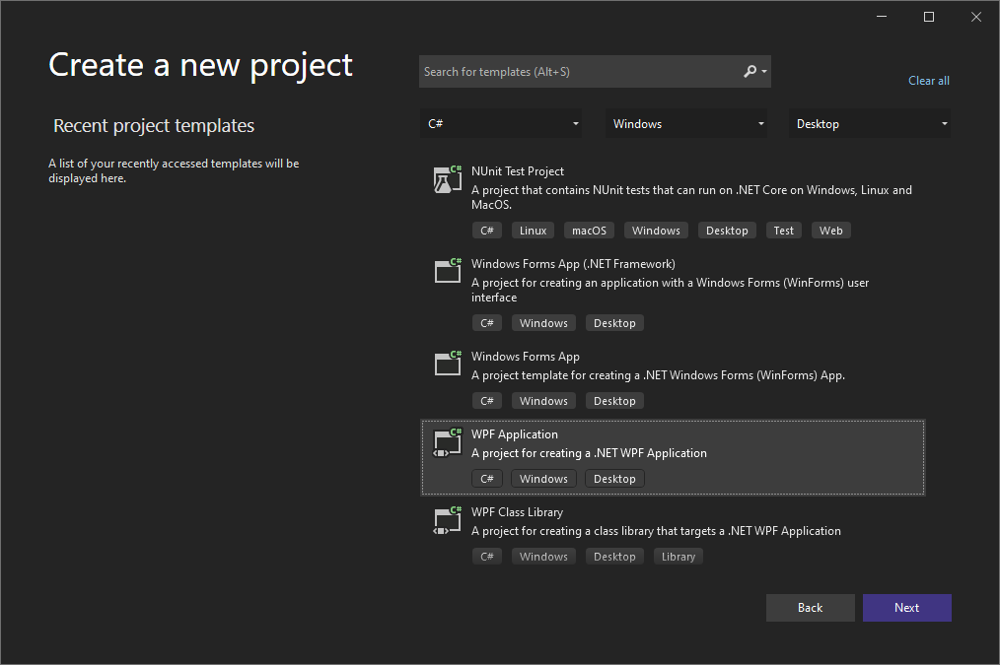
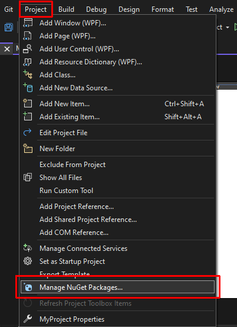
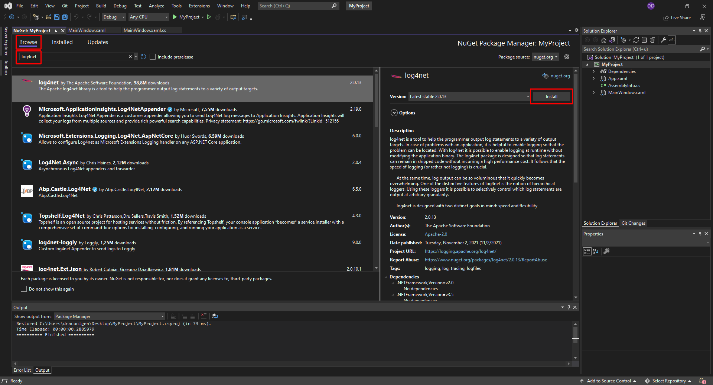
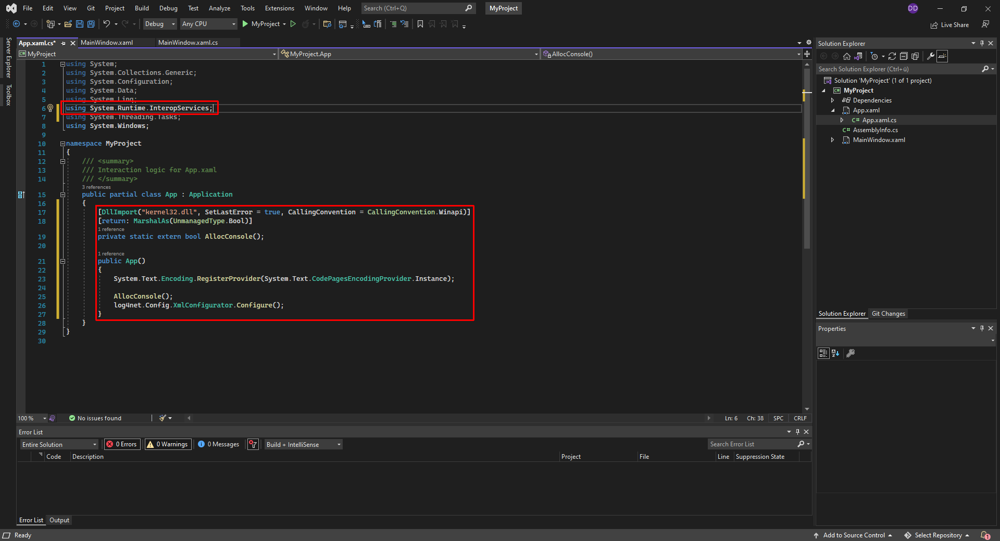
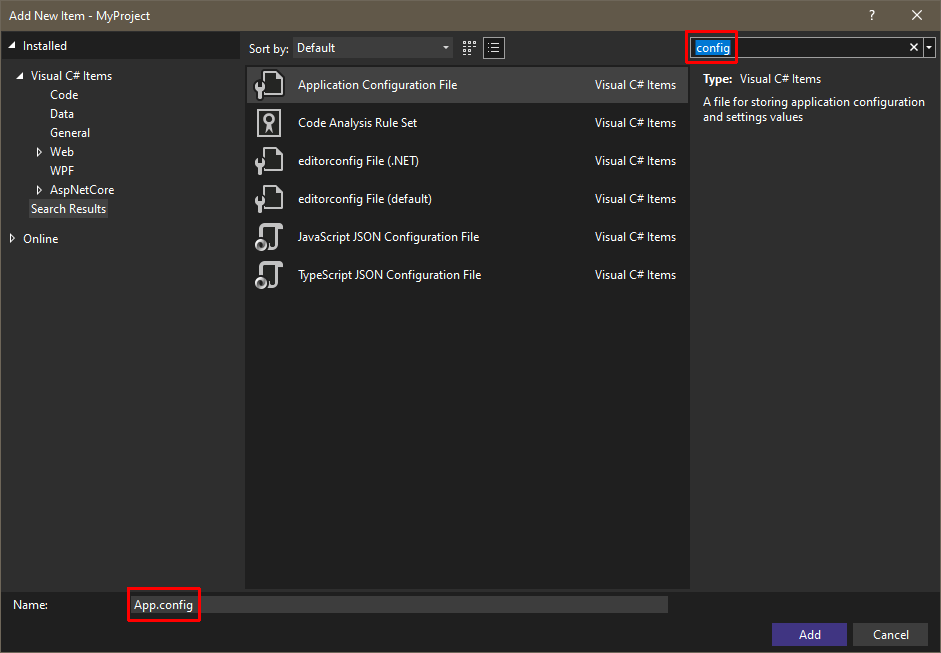
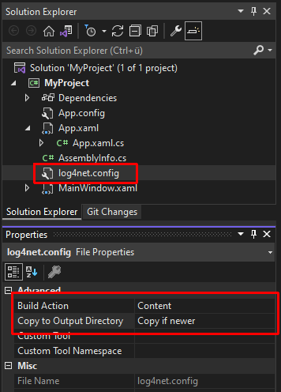
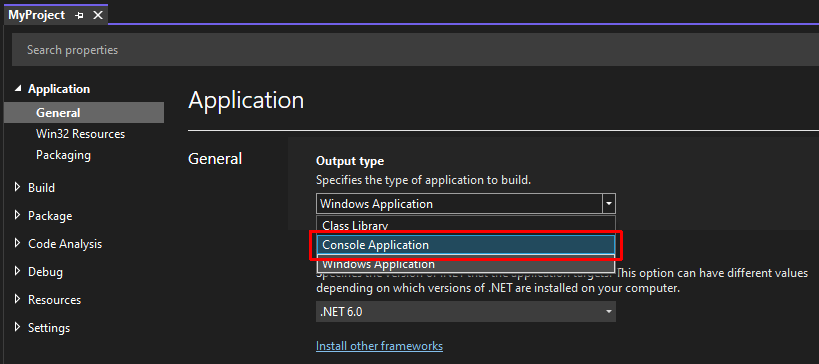
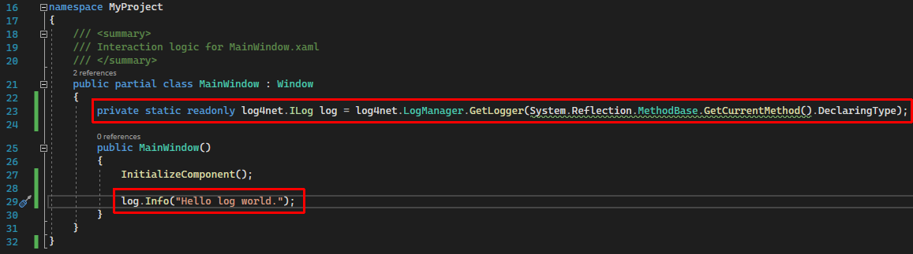
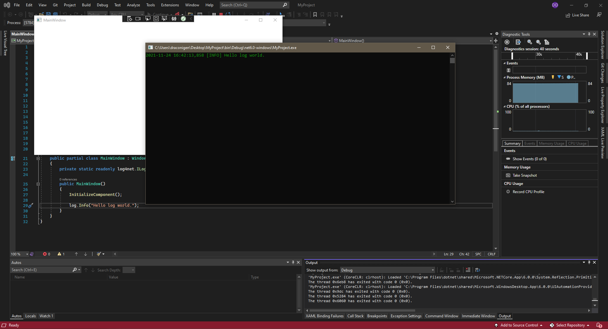

# Log4Net + .NET 6 Integration Guide

## Introduction 
I love live logging. The view of a console window being filled with a colorful representation of the inner workings of my application fills me with joy.

Hence I've constructed this logging solution for my most common target platform, [Windows Presentation Foundation (WPF)](https://docs.microsoft.com/en-us/visualstudio/designers/getting-started-with-wpf) applications, utilizing the feature-rich [Apache Log4Net](https://logging.apache.org/log4net/) library and enabling live logging out of the box, with options prepared for (rolling) file logging as well.

> Note: the following tutorial has been written in November 2021 and may be outdated by the time you read it. Feedback and [Pull Requests](pulls) with improvements are always welcome.

---

### Tutorial



Create a .NET 6 WPF project.

---



Open the NuGet Packages Manager.

---



Go to Browse, search "*log4net*" and hit install. You may close the NuGet Package Manager afterwards.

---



Open the App.xaml.cs file and add the following code to the App class:

```c#
[DllImport("kernel32.dll", SetLastError = true, CallingConvention = CallingConvention.Winapi)]
[return: MarshalAs(UnmanagedType.Bool)]
private static extern bool AllocConsole();

public App()
{
    System.Text.Encoding.RegisterProvider(System.Text.CodePagesEncodingProvider.Instance);

    AllocConsole();
    log4net.Config.XmlConfigurator.Configure();
}
```

The IDE should remind you to include `using System.Runtime.InteropServices`, too.

---



Right-click on the project (not the solution!) and select _Add_ > *New Item...*, then search for "*config*" and add an Application Configuration File named `App.config`. Fill it with the following configuration:

```xml
<?xml version="1.0" encoding="utf-8" ?>
<configuration>
	<configSections>
		<section name="log4net" type="log4net.Config.Log4NetConfigurationSectionHandler,log4net" />
	</configSections>
	<log4net configSource="log4net.config" />
</configuration>
```

---

When that's done, add **another** Application Configuration File and name it `log4net.conf` this time. Insert the following content:

```xml
<log4net>
	<root>
		<level value="ALL"/>
		<!--<appender-ref ref="FileAppender"/>-->
		<!--<appender-ref ref="RollingFileAppender"/>-->
		<appender-ref ref="ConsoleAppender"/>
	</root>

	<appender name="FileAppender" type="log4net.Appender.FileAppender">
		<file type="log4net.Util.PatternString" value="log\log-%date{yyyy-MM-dd_HH-mm-ss}.log"/>
		<appendToFile value="true"/>
		<layout type="log4net.Layout.PatternLayout">
			<conversionPattern value="%date [%level] %message%newline"/>
		</layout>
	</appender>

	<appender name="RollingFileAppender" type="log4net.Appender.RollingFileAppender">
		<file value="log\_lrdemo.log"/>
		<appendToFile value="true"/>
		<rollingStyle value="Size"/>
		<maxSizeRollBackups value="5"/>
		<maximumFileSize value="4MB"/>
		<staticLogFileName value="true"/>
		<layout type="log4net.Layout.PatternLayout">
			<conversionPattern value="%date [%level] %message%newline"/>
		</layout>
	</appender>

	<appender name="ConsoleAppender" type="log4net.Appender.ColoredConsoleAppender">
		<mapping>
			<level value="FATAL" />
			<foreColor value="White" />
			<backColor value="Red, HighIntensity" />
		</mapping>
		<mapping>
			<level value="ERROR" />
			<foreColor value="Red, HighIntensity" />
			<backColor value="White" />
		</mapping>
		<mapping>
			<level value="WARN"/>
			<foreColor value="Yellow, HighIntensity" />
		</mapping>
		<mapping>
			<level value="INFO"/>
			<foreColor value="Green" />
		</mapping>
		<mapping>
			<level value="DEBUG"/>
			<foreColor value="White" />
		</mapping>
		<layout type="log4net.Layout.PatternLayout">
			<!--<conversionPattern value="%date %method in %file:%line [%-5level] %message%newline" />-->
			<conversionPattern value="%date [%level] %message%newline"/>
		</layout>
	</appender>
</log4net>
```

---



Now, click on the `log4net.conf` file to view its' file properties and change *Build Action* to *Content* and *Copy to Output Directory* to *Copy if newer*

---



Go to the project settings and set *Output Type* to *Console Application*.

---



Now to utilize logging in a class, add the following line as class property and try logging anything from within the code:

```c#
private static readonly log4net.ILog log = log4net.LogManager.GetLogger(System.Reflection.MethodBase.GetCurrentMethod().DeclaringType);
```

When you now run the application, you should see a second console window pop up and display your logged message:

